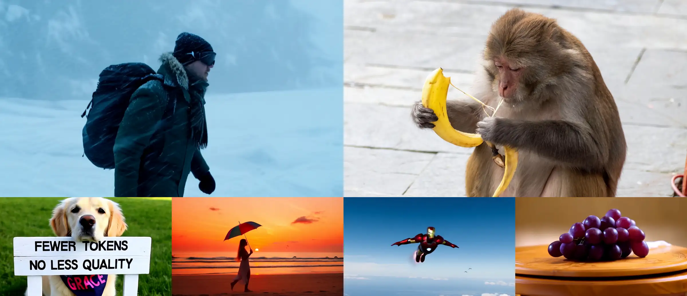
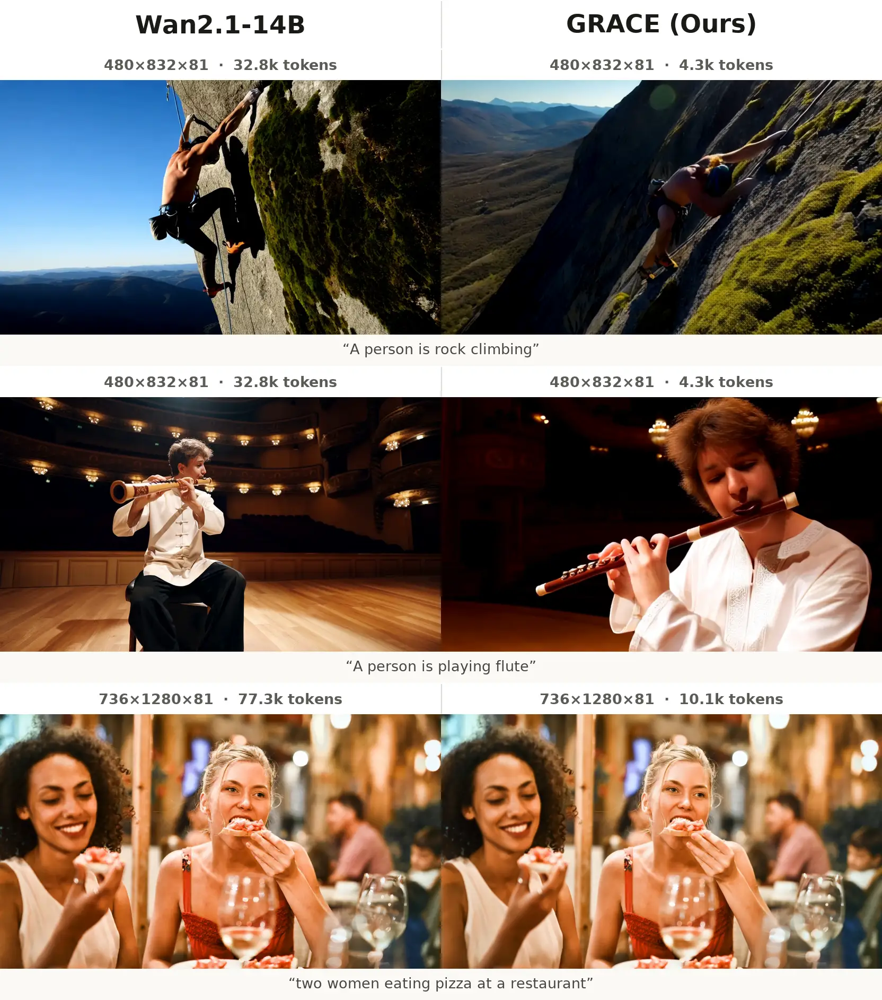
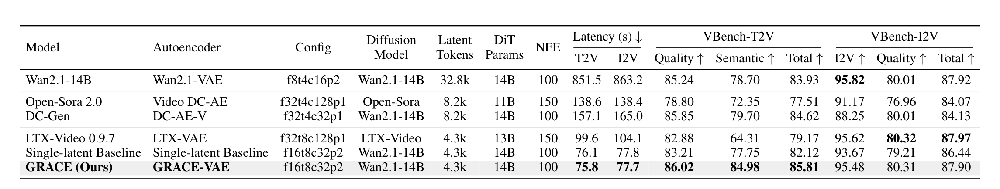
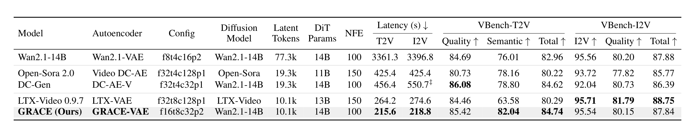
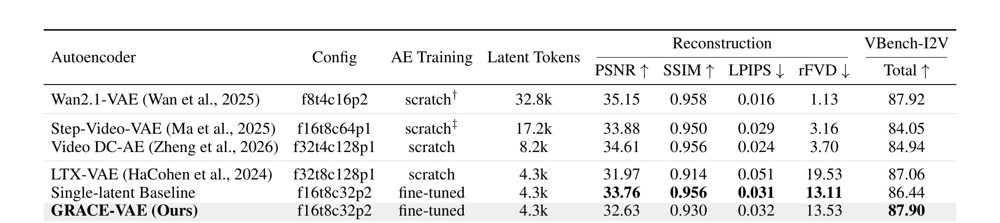

<div align="center">

<picture>
  <source media="(prefers-color-scheme: dark)" srcset="assets/grace_logo_white.svg">
  
</picture>

#### Generation-Aware Latent Compression for Efficient Video Generation

**Fewer tokens. No less quality.**

[](https://cvlab-kaist.github.io/GRACE/)
[](https://arxiv.org/abs/2610.10524)
[](assets/GRACE_paper.pdf)
[](https://huggingface.co/chimaharicox/GRACE)

This is our official implementation of the paper **"Generation-Aware Latent Compression for Efficient Video Generation"** by
[Jiyoung Kim](https://scholar.google.com/citations?user=DqG-ybIAAAAJ&hl=ko)<sup>1</sup>, [Paul Hyunbin Cho](https://github.com/paulcho98)<sup>1</sup>, [Jisu Nam](https://nam-jisu.github.io/)<sup>1</sup>, Donghoon Lee<sup>2</sup>, Hyunsung Go<sup>2</sup>, Yeonkyeong Lee<sup>2</sup>, Hansaem Kim<sup>2</sup>, Seungryong Kim<sup>1</sup>.

<sup>1</sup> KAIST AI &nbsp;&nbsp;&nbsp; <sup>2</sup> Kakao Corp.

<sub>This work was done while the first three authors were interns at Kakao Corp.</sub>

</div>

**GRACE** compresses a pretrained video autoencoder so that a pretrained DiT can generate from far fewer latent tokens —
without retraining the DiT from scratch.

GRACE compresses both axes at once — 16× spatially and 8× temporally — and reaches the generation quality of the
pretrained pipeline with three pieces:

- **Dual-latent representation.** A frozen **base latent** keeps the representation in the space the DiT already knows; a learned
  **residual latent** carries the detail that stronger compression would otherwise throw away. The DiT therefore starts
  from a latent space it already models instead of learning one from scratch.
- **Generation-aware alignment.** During training the compressed latent is matched to the pretrained one **inside the
  frozen DiT's feature space**, so the autoencoder is optimized for generation rather than for reconstruction alone.
  Better reconstruction does not mean better generation — the tables below show autoencoders that reconstruct 1–2 dB
  higher yet score lower on VBench.
- **Asymmetric denoising.** At inference the base is denoised ahead of the residual by a fixed offset (δ=0.15), so the
  residual adds detail onto content that is already settled.

The result: **8× fewer latent tokens and VBench scores that match the uncompressed model**, at **11.1× lower latency
at 480×832×81** and **15.5× at 736×1280×81** — the speedup grows with resolution. More results are on the
[project page](https://cvlab-kaist.github.io/GRACE/).


<div align="center">

<sub>Text-to-video and image-to-video samples from GRACE. More on the <a href="https://cvlab-kaist.github.io/GRACE/">project page</a>.</sub>
</div>

## 🔥 TODO

- ☑️ Inference code for T2V / I2V release
- ☑️ Checkpoints for T2V / I2V release on HuggingFace 🤗
- ⬜ HuggingFace 🤗 demo release
- ⬜ Stage-1 / Stage-2 training code release

## 📊 Results

### Video generation comparison

<div align="center">

<sub>Before and after compression — 8× fewer latent tokens (32.8k → 4.3k at 480×832×81, 77.3k → 10.1k at 736×1280×81).<br>Prompts shown are the VBench captions the videos are scored against.</sub>
</div>


### Video generation on VBench

**At 480×832×81.** GRACE matches uncompressed Wan2.1-14B on both tasks while using 8× fewer tokens and
running 11.1× faster.



**At 736×1280×81.** The gap widens with resolution — 15.5× faster.



### Video autoencoder comparison

Reconstruction at 256×256×81, and the VBench-I2V total after adapting the same pretrained Wan2.1-I2V-14B to
every latent under an equal budget. **Better reconstruction does not mean better generation.**



## ⚙️ Setup

```bash
git clone https://github.com/cvlab-kaist/GRACE.git
cd GRACE
pip install -r requirements.txt
```

> [!WARNING]
> **Use the DiffSynth-Studio copy in this repo, not a pip install.**
> `third_party/DiffSynth-Studio` is a fork and is what every script loads by default. The upstream release silently
> ignores two settings our checkpoints rely on — it runs without error and returns **different videos**.
> Each run prints which copy it loaded:
>
> ```
> [diffsynth] .../third_party/DiffSynth-Studio/diffsynth/pipelines/wan_video.py
>             rope_pos_scale applied=True
> ```

## 📦 Weights

| Model | | |
|---|---|---|
| **GRACE** | [🤗 chimaharicox/GRACE](https://huggingface.co/chimaharicox/GRACE) | our DiT, VAE and decoder — downloaded automatically |
| **Wan2.1-T2V-14B** | [🤗 Wan-AI/Wan2.1-T2V-14B](https://huggingface.co/Wan-AI/Wan2.1-T2V-14B) | base model for text-to-video |
| **Wan2.1-I2V-14B-480P** | [🤗 Wan-AI/Wan2.1-I2V-14B-480P](https://huggingface.co/Wan-AI/Wan2.1-I2V-14B-480P) | base model for image-to-video |

**Ours.** Downloaded on the first run into `./checkpoints`:

```
checkpoints/
├── t2v/  dit.safetensors  vae.ckpt  decoder.ckpt  zmain_stats.json
└── i2v/  dit.safetensors  vae.ckpt  decoder.ckpt  zmain_stats.json
```

**Wan2.1 base.** Download once, then point GRACE at them:

```bash
pip install "huggingface_hub[cli]"
huggingface-cli download Wan-AI/Wan2.1-T2V-14B --local-dir ./Wan2.1-T2V-14B
# the I2V release is needed for both tasks - it carries the T5, VAE and tokenizer
huggingface-cli download Wan-AI/Wan2.1-I2V-14B-480P --local-dir ./Wan2.1-I2V-14B-480P

export GRACE_WAN_T2V_DIR=./Wan2.1-T2V-14B
export GRACE_WAN_I2V_DIR=./Wan2.1-I2V-14B-480P
```

<details>
<summary>Putting the weights somewhere else</summary>

```bash
python tools/download_weights.py --task t2v --dest /your/path
export GRACE_CKPT_DIR=/your/path
```

`GRACE_NO_AUTO_DOWNLOAD=1` turns the automatic fetch off. Individual files can be pointed somewhere
else with `GRACE_DIT_T2V`, `GRACE_VAE_CKPT`, `GRACE_DECODER_CKPT`, `GRACE_ZMAIN_STATS` and the matching
`*_I2V` names; each one wins over the layout above.

</details>

## 📏 Evaluation

Scores come from [VBench](https://github.com/Vchitect/VBench) and VBench-I2V under the official protocol:
50 sampling steps, CFG 5, batch size 1, bf16, one video per prompt.

### Benchmark prompts

Every number in the tables was produced with the prompts that ship with the repo:

```
assets/vbench/prompts/
├── prompts_per_dimension_FINAL480   T2V, 1362 prompts over 16 dimensions
├── prompts_per_dimension_FINAL736   T2V at 736×1280
├── i2v_FINAL_base.json              I2V, 355 image/prompt pairs
└── i2v_FINAL_camera.json            I2V camera-motion split, 763 pairs
```

### Running the benchmark

Call the entry point directly. It walks the VBench dimensions and writes one video per prompt:

```bash
python src/inference_t2v_geoprior.py --out_dir outputs/vbench480 \
  --vbench_json assets/vbench/VBench_full_info.json \
  --augmented_prompts --aug_prompt_dir assets/vbench/prompts/prompts_per_dimension_FINAL480 \
  --per_dim 999 --dit_checkpoint ... --vae_checkpoint ... --zmain_stats_path ...
```

For I2V, point `PROMPTS_JSON=` at one of the two JSON files above.

### Latency

```bash
bash scripts/benchmark_latency.sh t2v     # writes outputs/latency_t2v.json
```

`tools/benchmark_latency.py` times the same window every model in the table was timed over — for t2v,
the first DiT forward to the end of the final VAE decode; for i2v, the first VAE encode to that same
point. Loading, text encoding and mp4 writing are outside it. The first video is a warm-up and dropped;
the median of the rest is reported with the encode / denoise / decode split and peak memory.

## 🚀 Inference

### Text-to-video

One prompt, or a text file with one prompt per line.

```bash
bash scripts/generate_t2v.sh "a shark is swimming in the ocean" outputs/t2v
```

### Image-to-video

An image and a prompt.

```bash
bash scripts/generate_i2v.sh photo.png "a penguin walking on a beach" outputs/i2v
```

For a batch, pass a folder instead of one file:

```bash
bash scripts/generate_i2v.sh assets/images outputs/i2v
```

The prompt applies to every image in the folder. If you omit it, each image is captioned by its own filename.
To give each image a different prompt, pass a JSON file:

```bash
PROMPTS_JSON=prompts.json bash scripts/generate_i2v.sh assets/images outputs/i2v
```

```json
[{"image_name": "photo.png", "prompt_en": "a penguin walking on a beach"}]
```

### Settings

They go in front of the command as environment variables:

```bash
HEIGHT=736 WIDTH=1280 bash scripts/generate_t2v.sh "a shark is swimming in the ocean" outputs/t2v
```

The defaults are the paper's: `HEIGHT`/`WIDTH` 480/832, `FRAMES` 81, `STEPS` 50, `CFG` 5.0, `SEED` 0, and
`GRACE_DELTA` 0.15 for the asymmetric denoising offset δ.

These commands are for trying the model out. Reproducing the numbers in the tables needs the prompt sets
this repo ships — see [Evaluation](#-evaluation) above.

## 📄 License

Our code is released under the MIT License. `third_party/DiffSynth-Studio` is redistributed under its original
Apache-2.0 license. Wan2.1 base weights are **not** redistributed here; obtain them from the official release and
follow their license.

## 📚 BibTeX

```bibtex
@misc{kim2026gracegenerationawarelatentcompression,
      title={GRACE: Generation-aware latent compression for efficient video generation}, 
      author={Jiyoung Kim and Paul Hyunbin Cho and Jisu Nam and Donghoon Lee and Hyunsung Go and Yeonkyeong Lee and Hansaem Kim and Seungryong Kim},
      year={2026},
      eprint={2610.10524},
      archivePrefix={arXiv},
      primaryClass={cs.CV},
      url={https://arxiv.org/abs/2610.10524}, 
}
```

## 🙏 Acknowledgements

Built on [Wan2.1](https://github.com/Wan-Video/Wan2.1) and [DiffSynth-Studio](https://github.com/modelscope/DiffSynth-Studio).
Evaluation uses [VBench](https://github.com/Vchitect/VBench).
